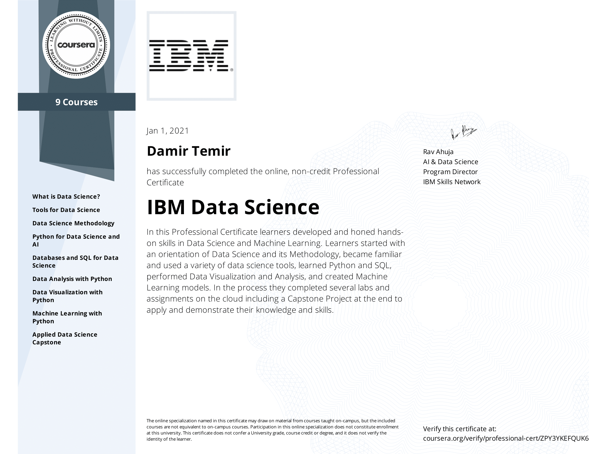

# IBM Data Science Professional Certification

This repository serves as a way for me to document my experience with the [IBM Data Science Professional Certificate program](https://www.coursera.org/professional-certificates/ibm-data-science). 
The program proved to be a great introduction to the field of Applied Data Science. 
The program has a lot of hands-on activities and interactive labs, which is an effective medium for learning.

By taking the course, you will learn useful **tools**, like **Jupyter Notebook** and **RStudio**.
You will also get experience with the **libraries** like **Pandas**, **NumPy**, **Matplotlib**, **Seaborn**, **Folium**, **Scikit-Learn**, and others.
Most importantly, you will accomplish interesting **projects** like **Random Album Generator**, **Predicting Housing Prices**, and **Building a Classifier Model**.

There are 9 courses:

Sq. |Name | Directory Link | Credential
--- | --- | --- | --- 
1 | What is Data Science? | Mostly Lectures & Reading | [Credential](https://www.coursera.org/account/accomplishments/certificate/C9WYWYYBWWYZ)
2 | Tools for Data Science | [Directory](https://github.com/dtemir/data-science-IBM/tree/main/tools) | [Credential](https://www.coursera.org/account/accomplishments/certificate/DAT3YC5J5XPZ)
3 | Data Science Methodology | Mostly Lectures & Reading | [Credential](https://www.coursera.org/account/accomplishments/certificate/BREB3HZG3N85)
4 | Python for Data Science and AI | [Directory](https://github.com/dtemir/data-science-IBM/tree/main/python) | [Credential](https://www.coursera.org/account/accomplishments/certificate/28DCUVZ4WGDN)
5 | Databases and SQL for Data Science | [Directory](https://github.com/dtemir/data-science-IBM/tree/main/databases) | [Credential](https://www.coursera.org/account/accomplishments/certificate/6TJ4DHBQNCCS)
6 | Data Analysis with Python | [Directory](https://github.com/dtemir/data-science-IBM/tree/main/analysis) | [Credential](https://www.coursera.org/account/accomplishments/certificate/4TKRW5YZCDS3)
7 | Data Visualization with Python | [Directory](https://github.com/dtemir/data-science-IBM/tree/main/visualization) | [Credential](https://www.coursera.org/account/accomplishments/certificate/52X8DYTD2RL6)
8 | Machine Learning with Python | [Directory](https://github.com/dtemir/data-science-IBM/tree/main/machine-learning) | [Credential](https://www.coursera.org/account/accomplishments/certificate/9T6WGR3HJXDW)
9 | Applied Data Science Capstone | [Directory](https://github.com/dtemir/data-science-IBM/tree/main/capstone) | [Credential](https://www.coursera.org/account/accomplishments/certificate/6T2ZXQ8GJBVD)

