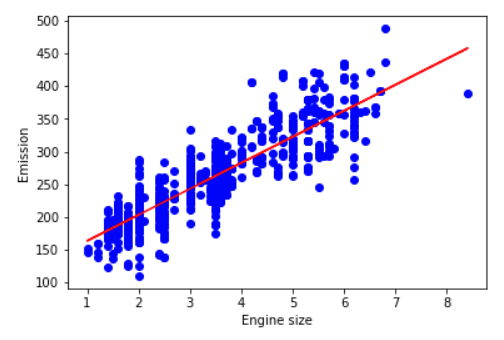
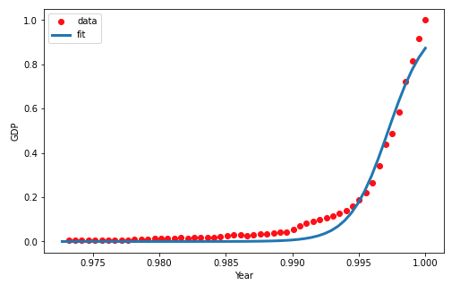
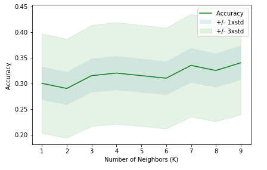
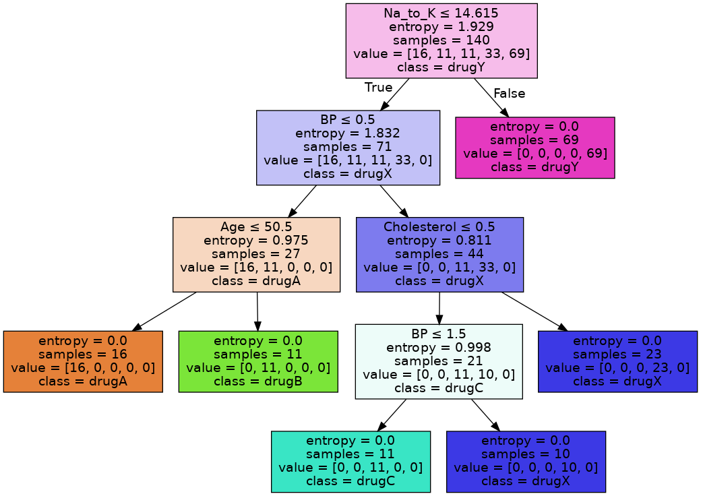
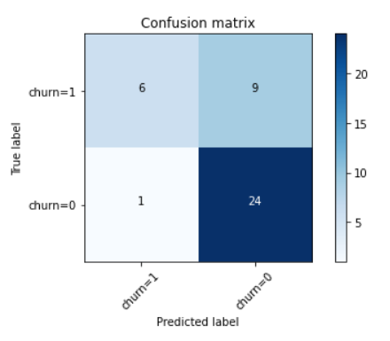
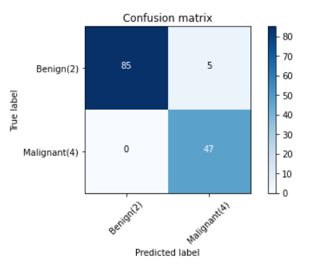
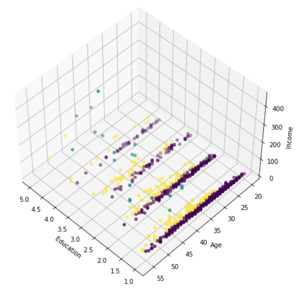
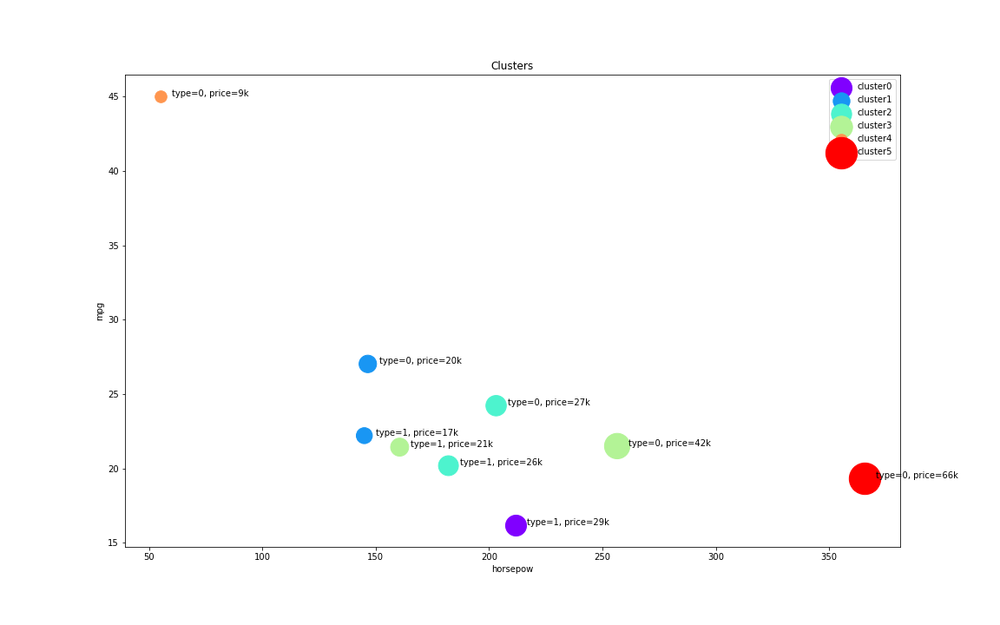
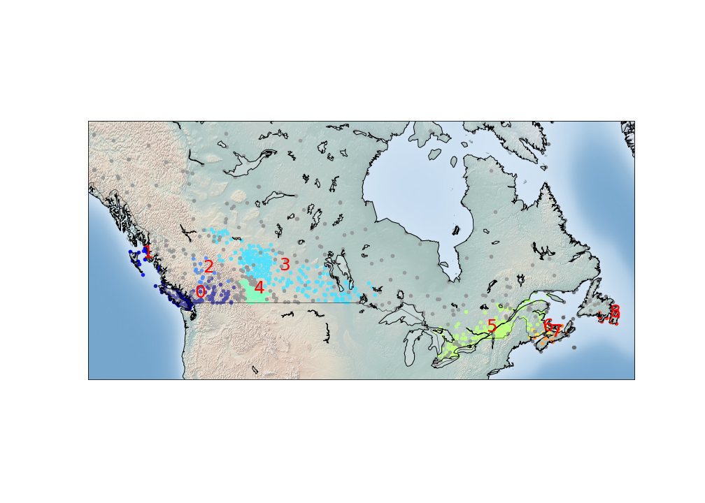

### Week 1 - Introduction to Machine Learning

In this week, you will learn about applications of Machine Learning in different fields such as health care, banking, telecommunication, and so on. You’ll get a general overview of Machine Learning topics such as supervised vs unsupervised learning, and the usage of each algorithm. Also, you understand the advantage of using Python libraries for implementing Machine Learning models.

### Week 2 - Regression

In this week, you will get a brief intro to regression. You learn about Linear, Non-linear, Simple and Multiple regression, and their applications. You apply all these methods on two different datasets, in the lab part. Also, you learn how to evaluate your regression model, and calculate its accuracy.

In [**Simple-Linear Regression.ipynb**](https://github.com/dtemir/data-science-IBM/blob/main/machine-learning/Simple-Linear-Regression.ipynb)
we learn about linear regression analysis by fitting the model to the data on cars fuel consumption, [*FuelConsumption.csv*](https://github.com/dtemir/data-science-IBM/tree/main/machine-learning/FuelConsumption.csv).

In [**Multiple-Linear-Regression.ipynb**](https://github.com/dtemir/data-science-IBM/blob/main/machine-learning/Multiple-Linear-Regression.ipynb)
learn about linear regression analysis by fitting the model to the data on cars fuel consumption, [*FuelConsumption.csv*](https://github.com/dtemir/data-science-IBM/tree/main/machine-learning/FuelConsumption.csv) with multiple variables.

In [**Non-Linear-Regression.ipynb**](https://github.com/dtemir/data-science-IBM/blob/main/machine-learning/Non-Linear-Regression.ipynb) 
we learn about non-linear regression analysis by fitting the model to the datapoints of China's GDP from 1960 to 2014, [*china_gdp.csv*](https://github.com/dtemir/data-science-IBM/tree/main/machine-learning/china_gdp.csv).

### Week 3 - Classification

In this week, you will learn about classification technique. You practice with different classification algorithms, such as KNN, Decision Trees, Logistic Regression and SVM. Also, you learn about pros and cons of each method, and different classification accuracy metrics.

In [**K-Nearest-neighbord.ipynb**](https://github.com/dtemir/data-science-IBM/blob/main/machine-learning/K-Nearest-neighbord.ipynb)
we learn about K-Nearest Neighbors by fitting the model to the data of a telecommunication provider, [*teleCust1000t.csv*](https://github.com/dtemir/data-science-IBM/blob/main/machine-learning/teleCust1000t.csv). We find the best number of neighbors to use for the algorithm.

In [**Decision-Trees.ipynb**](https://github.com/dtemir/data-science-IBM/blob/main/machine-learning/Decision-Trees.ipynb) we learn about Decision Trees by fitting the model to the data of a medical research on what type of drug to presribe a patient, [*drug200.csv*](https://github.com/dtemir/data-science-IBM/blob/main/machine-learning/drug200.csv). We build a decision tree based on the data.

In [**Logistic-Regression.ipynb**](https://github.com/dtemir/data-science-IBM/blob/main/machine-learning/Logistic-Regression.ipynb) we learn about Logistic Regression by fitting the model to the data of a telecommunication company that is trying to save a customer from leaving thir services, [*ChurnData.csv*](https://github.com/dtemir/data-science-IBM/blob/main/machine-learning/ChurnData.csv). We build a logistic regression model to predict whether the customer will leave the services.

In [**Support-Vector-Machines**](https://github.com/dtemir/data-science-IBM/blob/main/machine-learning/Support-Vector-Machines.ipynb) we learn about Support Vector Machines by fitting the model to the data on human cell cancer, trying to idenity whether a certain cell is benign or malignant, [*cell_samples.csv*](https://github.com/dtemir/data-science-IBM/blob/main/machine-learning/cell_samples.csv). In other words, we tried to build an SVM to predict whether a human cell is cancerous.

### Week 4 - Clustering

In this section, you will learn about different clustering approaches. You learn how to use clustering for customer segmentation, grouping same vehicles, and also clustering of weather stations. You understand 3 main types of clustering, including Partitioned-based Clustering, Hierarchical Clustering, and Density-based Clustering.

In [**K-Means Clustering**](https://github.com/dtemir/data-science-IBM/blob/main/machine-learning/K-Means.ipynb)
we learn about K-Means Clustering by fitting the model to the data on some customers with differrent characteristics like income, education type, debt, and debt to income ratio, [*Cust_Segmentation.csv*](https://github.com/dtemir/data-science-IBM/blob/main/machine-learning/Cust_Segmentation.csv).

In [**Hierarchical Clustering**](https://github.com/dtemir/data-science-IBM/blob/main/machine-learning/Hierarchical.ipynb) 
we learn about Hierarchical Clustering by fitting the model to the data on car characteristics to cluster them into groups in order to determine what cars are competing with each other in the market, [*cars_clus.csv*](https://github.com/dtemir/data-science-IBM/blob/main/machine-learning/cars_clus.csv).

In [**Density-Based Clustering (DBSCN)**](https://github.com/dtemir/data-science-IBM/blob/main/machine-learning/DBSCN.ipynb) 
we learn about Density-Based Clustering by fitting the model on the Canadian Weather Stations, [*weather-stations.csv*](https://github.com/dtemir/data-science-IBM/blob/main/machine-learning/weather-stations20140101-20141231.csv). In the picture below, we clustered the weather stations based on their locations and temperature.

### Week 5 - Recommender Systems

In this module, you will learn about recommender systems. First, you will get introduced with main idea behind recommendation engines, then you understand two main types of recommendation engines, namely, content-based and collaborative filtering.

In [**Content-Based Filtering**](https://github.com/dtemir/data-science-IBM/blob/main/machine-learning/Content-Based-Filtering.ipynb)
we learn about the way to filter movies based on their genres. The dataset was acquired from [GroupLens](https://grouplens.org/datasets/movielens/?cm_mmc=Email_Newsletter-_-Developer_Ed%2BTech-_-WW_WW-_-SkillsNetwork-Courses-IBMDeveloperSkillsNetwork-ML0101EN-SkillsNetwork-20718538&cm_mmca1=000026UJ&cm_mmca2=10006555&cm_mmca3=M12345678&cvosrc=email.Newsletter.M12345678&cvo_campaign=000026UJ&cm_mmc=Email_Newsletter-_-Developer_Ed%2BTech-_-WW_WW-_-SkillsNetwork-Courses-IBMDeveloperSkillsNetwork-ML0101EN-SkillsNetwork-20718538&cm_mmca1=000026UJ&cm_mmca2=10006555&cm_mmca3=M12345678&cvosrc=email.Newsletter.M12345678&cvo_campaign=000026UJ&cm_mmc=Email_Newsletter-_-Developer_Ed%2BTech-_-WW_WW-_-SkillsNetwork-Courses-IBMDeveloperSkillsNetwork-ML0101EN-SkillsNetwork-20718538&cm_mmca1=000026UJ&cm_mmca2=10006555&cm_mmca3=M12345678&cvosrc=email.Newsletter.M12345678&cvo_campaign=000026UJ&cm_mmc=Email_Newsletter-_-Developer_Ed%2BTech-_-WW_WW-_-SkillsNetwork-Courses-IBMDeveloperSkillsNetwork-ML0101EN-SkillsNetwork-20718538&cm_mmca1=000026UJ&cm_mmca2=10006555&cm_mmca3=M12345678&cvosrc=email.Newsletter.M12345678&cvo_campaign=000026UJ).

In the result, based on the input movies:

| id | title | rating |
| --- | --- | --- |
0 | Breakfast Club, The | 5.0
1 | Toy Story | 3.5
2 | Jumanji | 2.0
3 | Pulp Fiction | 5.0
4 | Akira | 4.5

We get recommendation:

| movieId | title | genres | year |
| --- | --- | --- | --- | 
| 673 | Space Jam | [Adventure, Animation, Children, Comedy, Fanta...] | 1996 |
| 1907 | Mulan | [Adventure, Animation, Children, Comedy, Drama...] | 1998 | 
| 2987 | Who Framed Roger Rabbit? | [Adventure, Animation, Children, Comedy, Crime...] | 1988 |
| 5018 | Motorama | [Adventure, Comedy, Crime, Drama, Fantasy, Mys...] | 1991 |
| 6902 | Interstate 60 | [Adventure, Comedy, Drama, Fantasy, Mystery, S...] | 2002 |
| 26093 | Wonderful World of the Brothers Grimm, The | [Adventure, Animation, Children, Comedy, Drama...] | 1962

In [**Collaborative Filtering**](https://github.com/dtemir/data-science-IBM/blob/main/machine-learning/Collaborative-Filtering.ipynb)
we learn about the way to filter movies based on the similarity with other users. We apply the Pearson Correlation to measure linear association between variables, such as two users. 

Based on the created table of movies we watched and ratings we gave them:

| id | title | rating |
| --- | --- | --- |
0 | Breakfast Club, The | 5.0
1 | Toy Story | 3.5
2 | Jumanji | 2.0
3 | Pulp Fiction | 5.0
4 | Akira | 4.5

We get recommendation through the other user's preference:

| movieId | title | year | 
| --- | --- | --- |
| 2200 | 2284 | Bandit Queen | 1994 | 
| 3243 | 3329 | Year My Voice Broke, The | 1987 |
| 3669 | 3759 | Fun and Fancy Free | 1947 |
| 3679 | 3769 | Thunderbolt and Lightfoot | 1974 |
| 3685 | 3775 | Make Mine Music | 1946 |

### Week 6 - Final Project

In this module, you will do a project based of what you have learned so far. You will submit a report of your project for peer evaluation.
