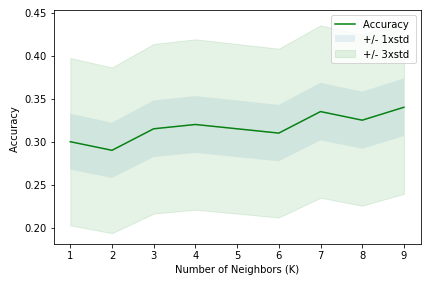

### Week 1 - Introduction to Machine Learning

In this week, you will learn about applications of Machine Learning in different fields such as health care, banking, telecommunication, and so on. You’ll get a general overview of Machine Learning topics such as supervised vs unsupervised learning, and the usage of each algorithm. Also, you understand the advantage of using Python libraries for implementing Machine Learning models.

### Week 2 - Regression

In this week, you will get a brief intro to regression. You learn about Linear, Non-linear, Simple and Multiple regression, and their applications. You apply all these methods on two different datasets, in the lab part. Also, you learn how to evaluate your regression model, and calculate its accuracy.

In [**Non-Linear-Regression.ipynb**](https://github.com/dtemir/data-science-IBM/blob/main/machine-learning/Non-Linear-Regression.ipynb) 
we learn about non-linear regression analysis by fitting the model to the datapoints of China's GDP from 1960 to 2014, [*china_gdp.csv*](https://github.com/dtemir/data-science-IBM/tree/main/machine-learning/china_gdp.csv).

In [**K-Nearest-neighbord**](https://github.com/dtemir/data-science-IBM/blob/main/machine-learning/K-Nearest-neighbord.ipynb)
we learn about K-Nearest Neighbors by fitting the model to the data of a telecommunication provider, [*teleCust1000t.csv*](https://github.com/dtemir/data-science-IBM/blob/main/machine-learning/teleCust1000t.csv). We find the best number of neighbors to use for the algorithm.

### Week 3 - Classification

In this week, you will learn about classification technique. You practice with different classification algorithms, such as KNN, Decision Trees, Logistic Regression and SVM. Also, you learn about pros and cons of each method, and different classification accuracy metrics.

### Week 4 - Clustering

In this section, you will learn about different clustering approaches. You learn how to use clustering for customer segmentation, grouping same vehicles, and also clustering of weather stations. You understand 3 main types of clustering, including Partitioned-based Clustering, Hierarchical Clustering, and Density-based Clustering.

### Week 5 - Recommender Systems

In this module, you will learn about recommender systems. First, you will get introduced with main idea behind recommendation engines, then you understand two main types of recommendation engines, namely, content-based and collaborative filtering.

### Week 6 - Final Project

In this module, you will do a project based of what you have learned so far. You will submit a report of your project for peer evaluation.

