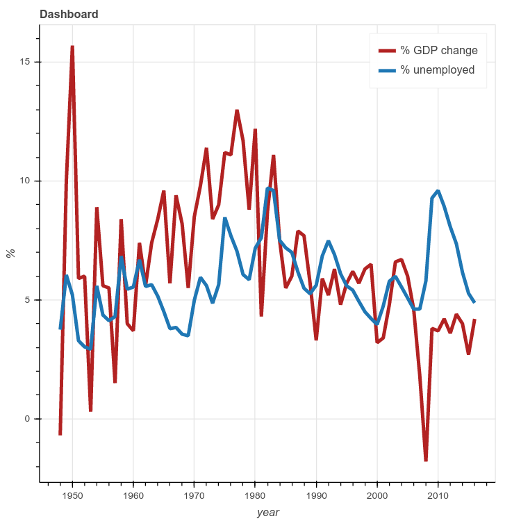

**The final assignment** was to read data of the US Economy to a pandas dataframe to build a dashboard showing the change in GDP and unemployment

### Week 1: Python Basics

* Types
* Variables
* Strings

### Week 2: Python Data Structures

* Lists and Tuples
* Dictionaries
* Sets
 
### Week 3: Python Programming Fundamentals

* Conditions and Branching
* Loops
* Functions
* Objects and Classes

### Week 4: Working with Data in Python

* Reading Files
* Writing Files
* Pandas
* NumPy (1D & 2D)
* APIs

### Week 5: Analyzing US Economic Data and Building a Dashboard

* Analyzing US Economic Data and Building a Dashboard