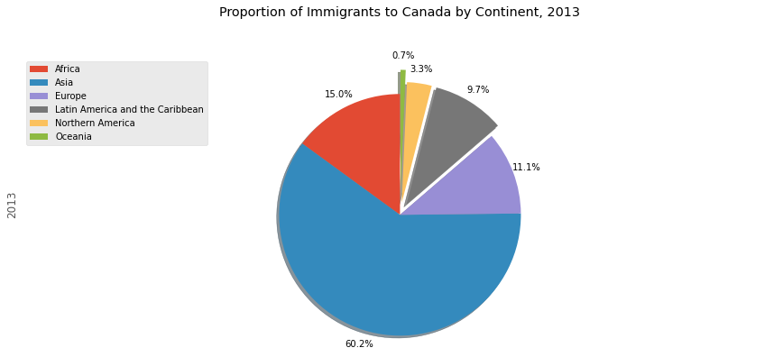

# [Data Visualization with Python](https://www.coursera.org/learn/python-for-data-visualization?)

### Week 1 - Introduction to Data Visualization Tools

In this module, you will learn about data visualization and some of the best practices to keep in mind when creating plots and visuals. You will also learn about the history and the architecture of Matplotlib and learn about basic plotting with Matplotlib. In addition, you will learn about the dataset on immigration to Canada, which will be used extensively throughout the course. Finally, you will briefly learn how to read csv files into a pandas dataframe and process and manipulate the data in the dataframe, and how to generate line plots using Matplotlib.

### Week 2 - Basic and Specialized Visualization Tools

In this module, you learn about area plots and how to create them with Matplotlib, histograms and how to create them with Matplotlib, bar charts, and how to create them with Matplotlib, pie charts, and how to create them with Matplotlib, box plots and how to create them with Matplotlib, and scatter plots and bubble plots and how to create them with Matplotlib.

### Week 3 - Advanced Visualizations and Geospatial Data

In this module, you will learn about advanced visualization tools such as waffle charts and word clouds and how to create them. You will also learn about seaborn, which is another visualization library, and how to use it to generate attractive regression plots. In addition, you will learn about Folium, which is another visualization library, designed especially for visualizing geospatial data. Finally, you will learn how to use Folium to create maps of different regions of the world and how to superimpose markers on top of a map, and how to create choropleth maps.

